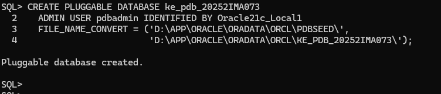
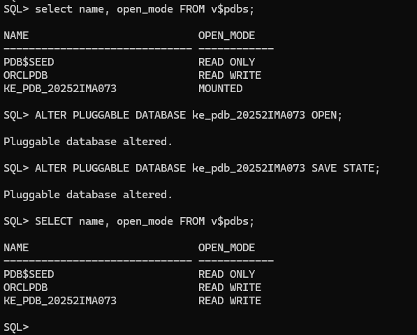
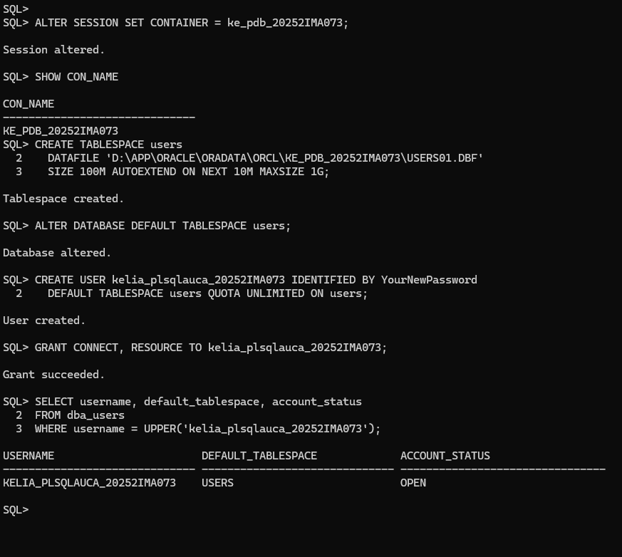
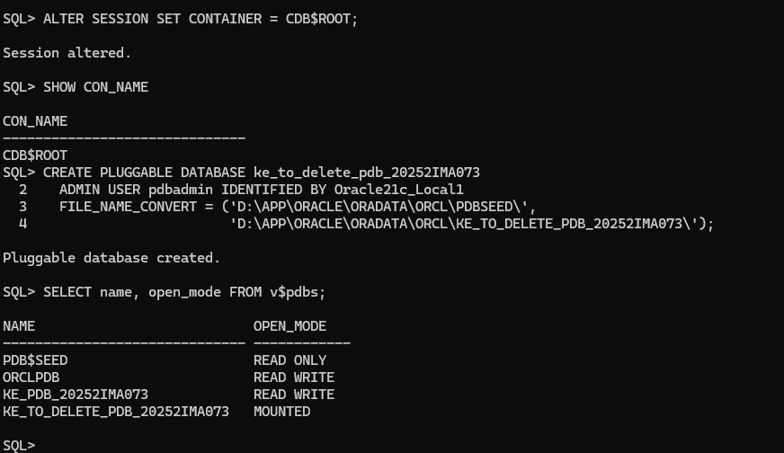
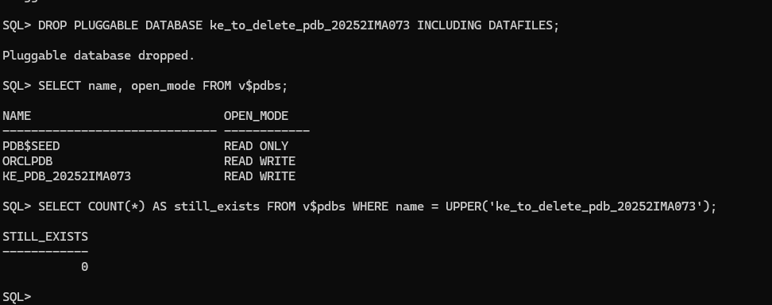
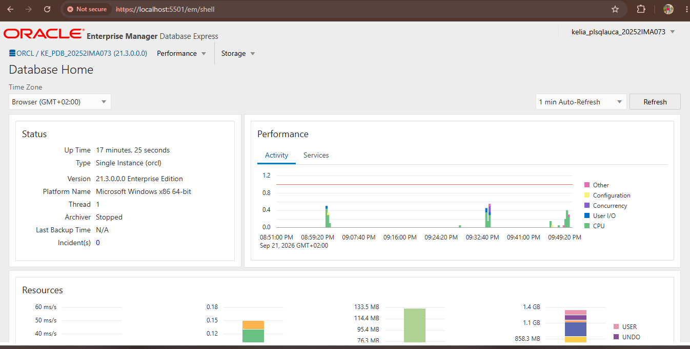

# Oracle Pluggable Databases (PDB) Management – Individual Assignment II

**Student:** Kelia Ishimwe Hakorimana · **Student ID:** 20252IMA073
**Course:** Database Development with PL/SQL (INSY 8311) · **Lecturer:** Eric Maniraguha

## 1. Overview of tasks

This assignment is about Oracle's multitenant architecture, where one container database (CDB) holds several pluggable databases (PDBs). It had four tasks:

1. **Create a new PDB** and create a user inside it.
2. **Create a temporary PDB and delete it** completely.
3. **Open Oracle Enterprise Manager (OEM)** and show a dashboard that reflects my work.
4. **Document everything on GitHub** with screenshots and this README.

## 2. Oracle environment used

- **Operating system:** Windows 11 Pro
- **Database:** Oracle Database 21c Enterprise Edition, version 21.3.0.0.0
- **Container database:** `orcl`, with the listener on port 1521
- **Tools:** SQL*Plus 21.3 for all the commands, and a web browser for Oracle Enterprise Manager Database Express (EM Express) on port 5501
- **Storage:** the database files are on drive D: under `D:\app\oracle\oradata`

## 3. Explanation of each task

### Task 1: Create a new pluggable database

I connected to the container database as SYS (`sqlplus sys@//localhost:1521/orcl as sysdba`) and checked that I was in `CDB$ROOT`. Then I created my PDB from the seed:

```sql
CREATE PLUGGABLE DATABASE ke_pdb_20252IMA073
  ADMIN USER pdbadmin IDENTIFIED BY <password>
  FILE_NAME_CONVERT = ('D:\APP\ORACLE\ORADATA\ORCL\PDBSEED\',
                       'D:\APP\ORACLE\ORADATA\ORCL\KE_PDB_20252IMA073\');
```

The `FILE_NAME_CONVERT` part was needed because this database has no default location for new PDB files. After creation the PDB was in the `MOUNTED` state, so I opened it and saved its state so it opens again after a restart:

```sql
ALTER PLUGGABLE DATABASE ke_pdb_20252IMA073 OPEN;
ALTER PLUGGABLE DATABASE ke_pdb_20252IMA073 SAVE STATE;
```

Then I switched into the PDB (`ALTER SESSION SET CONTAINER = ke_pdb_20252IMA073;`). The seed has no `USERS` tablespace, so I created one, made it the default, and created my user `kelia_plsqlauca_20252IMA073` with quota on it and the `CONNECT` and `RESOURCE` roles. This is the account I will use for the rest of the course.

Screenshots:





### Task 2: Create and delete a PDB

From `CDB$ROOT` I created a temporary PDB named `ke_to_delete_pdb_20252IMA073` using the same method as Task 1 and confirmed it in `V$PDBS`, where it showed as `MOUNTED`. Then I deleted it, including its data files:

```sql
ALTER PLUGGABLE DATABASE ke_to_delete_pdb_20252IMA073 CLOSE IMMEDIATE;
DROP PLUGGABLE DATABASE ke_to_delete_pdb_20252IMA073 INCLUDING DATAFILES;
```

The close command returned `ORA-65020` (already closed), because I never opened this PDB. The drop still worked and returned `Pluggable database dropped.` I checked again in `V$PDBS`: the PDB was no longer listed and a count of it returned 0.

Screenshots:




### Task 3: Oracle Enterprise Manager (OEM)

My database had EM Express switched off (its HTTPS port was 0). Inside my PDB I gave my user the `EM_EXPRESS_BASIC` role and set the port:

```sql
ALTER SESSION SET CONTAINER = ke_pdb_20252IMA073;
GRANT EM_EXPRESS_BASIC TO kelia_plsqlauca_20252IMA073;
EXEC DBMS_XDB_CONFIG.SETHTTPSPORT(5501);
```

Then I opened `https://localhost:5501/em` in the browser, accepted the certificate warning (it is a self-signed certificate on my own computer), and logged in as my own user. The dashboard shows my environment (`ORCL / KE_PDB_20252IMA073`, version 21.3.0.0.0) and my username `kelia_plsqlauca_20252IMA073` at the top right.

Screenshot:



### Task 4: Documentation and reporting

I created this public repository with the required structure (`README.md` and the `screenshots` folder with `pdb_creation`, `pdb_deletion` and `oem_dashboard`), added my screenshots, and wrote this report.

## 4. Challenges faced and how I solved them

- **Setting up Oracle 21c on my computer** took several steps: installing the software, creating the listener and the container database, and sorting out networking. I did this with help from an AI assistant, and it worked in the end.
- **No default place for PDB files.** I fixed it by using `FILE_NAME_CONVERT` in the `CREATE PLUGGABLE DATABASE` command.
- **The new PDB was `MOUNTED`.** I opened it, and used `SAVE STATE` so it stays open after a restart.
- **No `USERS` tablespace in the PDB.** I created one so my user's objects don't end up in `SYSTEM`.
- **The `ORA-65020` message** when closing the temporary PDB. It just meant the PDB was already closed, so I ran the drop anyway.
- **A wrong command location.** I typed `netstat` inside SQL*Plus and got `SP2-0734`. I learned that it is a Windows command and has to be run outside SQL*Plus.
- **EM Express was not enabled.** I set its port and gave my user the right role, as described in Task 3.

## 5. Integrity statement

I did this assignment myself. I ran every command on my own Oracle environment and took all the screenshots in this repository myself. My lecturer, Eric Maniraguha, allowed the use of AI tools for understanding and writing the Oracle commands, and afterwards also for writing and organizing this README. I used an AI assistant (Claude) for that, and also to help install and configure Oracle 21c on my computer. I did not copy anyone's work, screenshots or repository.

## 6. Submission details

```
Repository Link: https://github.com/kelia-ishimwe/oracle_pdb_ass_II_20252IMA073_kelia
PDB Name Created: ke_pdb_20252IMA073
Issues Encountered: Yes
```

## Appendix A: Accounts and passwords used

These are lab accounts on my own local Oracle installation for this course. The database runs only on my computer.

| Account | Where | Password | Used for |
|---|---|---|---|
| `SYS` (as SYSDBA) | container database `orcl` | `Oracle21c_Local1` | creating and deleting PDBs |
| `SYSTEM` | container database `orcl` | `Oracle21c_Local1` | administration (not used in the tasks) |
| `pdbadmin` | `ke_pdb_20252IMA073` and the temporary PDB | `Oracle21c_Local1` | the PDB's built-in administrator, created by `CREATE PLUGGABLE DATABASE` |
| `kelia_plsqlauca_20252IMA073` | `ke_pdb_20252IMA073` | `YourNewPassword` | my class account, also used to log in to EM Express |

Connection details:

| Item | Value |
|---|---|
| Host / port | `localhost` / `1521` |
| Container database service | `orcl` |
| My PDB service | `ke_pdb_20252IMA073` |
| EM Express address | `https://localhost:5501/em` |

Login from SQL*Plus with my class account:

```
sqlplus kelia_plsqlauca_20252IMA073@//localhost:1521/ke_pdb_20252IMA073
```

## Appendix B: Complete list of commands I ran, in order

All commands were run in SQL*Plus, connected as `SYS` to the `orcl` service.

```sql
-- Connect and set up the display
--   sqlplus sys@//localhost:1521/orcl as sysdba
SET LINESIZE 200
SET PAGESIZE 100
COL name FORMAT A30
COL open_mode FORMAT A12
COL username FORMAT A30
SHOW CON_NAME

-- Task 1: create my PDB
CREATE PLUGGABLE DATABASE ke_pdb_20252IMA073
  ADMIN USER pdbadmin IDENTIFIED BY Oracle21c_Local1
  FILE_NAME_CONVERT = ('D:\APP\ORACLE\ORADATA\ORCL\PDBSEED\',
                       'D:\APP\ORACLE\ORADATA\ORCL\KE_PDB_20252IMA073\');

SELECT name, open_mode FROM v$pdbs;
ALTER PLUGGABLE DATABASE ke_pdb_20252IMA073 OPEN;
ALTER PLUGGABLE DATABASE ke_pdb_20252IMA073 SAVE STATE;
SELECT name, open_mode FROM v$pdbs;

-- Task 1: create the tablespace and my user inside the PDB
ALTER SESSION SET CONTAINER = ke_pdb_20252IMA073;
SHOW CON_NAME

CREATE TABLESPACE users
  DATAFILE 'D:\APP\ORACLE\ORADATA\ORCL\KE_PDB_20252IMA073\USERS01.DBF'
  SIZE 100M AUTOEXTEND ON NEXT 10M MAXSIZE 1G;
ALTER DATABASE DEFAULT TABLESPACE users;

CREATE USER kelia_plsqlauca_20252IMA073 IDENTIFIED BY YourNewPassword
  DEFAULT TABLESPACE users QUOTA UNLIMITED ON users;
GRANT CONNECT, RESOURCE TO kelia_plsqlauca_20252IMA073;

SELECT username, default_tablespace, account_status
FROM dba_users
WHERE username = UPPER('kelia_plsqlauca_20252IMA073');

-- Task 2: create and delete the temporary PDB (from the container root)
ALTER SESSION SET CONTAINER = CDB$ROOT;
SHOW CON_NAME

CREATE PLUGGABLE DATABASE ke_to_delete_pdb_20252IMA073
  ADMIN USER pdbadmin IDENTIFIED BY Oracle21c_Local1
  FILE_NAME_CONVERT = ('D:\APP\ORACLE\ORADATA\ORCL\PDBSEED\',
                       'D:\APP\ORACLE\ORADATA\ORCL\KE_TO_DELETE_PDB_20252IMA073\');
SELECT name, open_mode FROM v$pdbs;

ALTER PLUGGABLE DATABASE ke_to_delete_pdb_20252IMA073 CLOSE IMMEDIATE;   -- ORA-65020: already closed
DROP PLUGGABLE DATABASE ke_to_delete_pdb_20252IMA073 INCLUDING DATAFILES;

SELECT name, open_mode FROM v$pdbs;
SELECT COUNT(*) AS still_exists FROM v$pdbs
WHERE name = UPPER('ke_to_delete_pdb_20252IMA073');

-- Task 3: enable EM Express for my PDB
ALTER SESSION SET CONTAINER = ke_pdb_20252IMA073;
GRANT EM_EXPRESS_BASIC TO kelia_plsqlauca_20252IMA073;
EXEC DBMS_XDB_CONFIG.SETHTTPSPORT(5501);
SELECT DBMS_XDB_CONFIG.GETHTTPSPORT AS em_port FROM dual;
```

Then in the browser: `https://localhost:5501/em`, accept the certificate warning, and log in as `kelia_plsqlauca_20252IMA073`.
